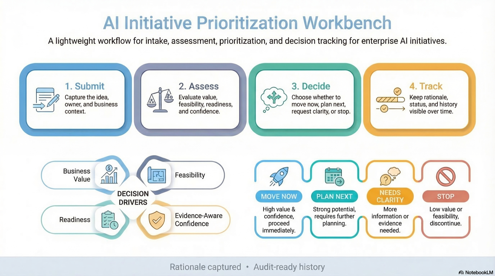

# AI Architect Decision Workbench

Decision-support workbench for enterprise AI intake, assessment, prioritization, and decision tracking.

This repository demonstrates a lightweight workflow for moving AI initiatives from idea to clear next step, with structured assessment, captured rationale, and audit-ready history.

Current version: `0.3.4`



## At A Glance
The workbench helps teams answer four questions:
1. Is this a good AI opportunity?
2. Is it ready enough to move now?
3. What needs a decision versus more clarity?
4. What was decided, and why?

The main flow is:
1. `Submit`
2. `Assess`
3. `Decide`
4. `Track`

Decision drivers:
1. `Business value`
2. `Feasibility`
3. `Readiness`
4. `Evidence-aware confidence`

Outcome states:
1. `Move now`
2. `Plan next`
3. `Needs clarity`
4. `Stop`

## Main Product Surface
The most current product module is [enterprise-ai-prioritizer/README.md](./enterprise-ai-prioritizer/README.md).

That module includes:
1. the running application
2. workflow and decision model details
3. local run and test instructions
4. UI screenshots and technical notes

## Quick Start
Run locally:
```bash
cd enterprise-ai-prioritizer
python3 server.py --host 127.0.0.1 --port 8787
```

Test from repository root:
```bash
npm test
npm run test:e2e
```

## Product Screenshots
<details>
<summary>Open UI screenshots</summary>

### Decision dashboard


### Assessment workspace


</details>
