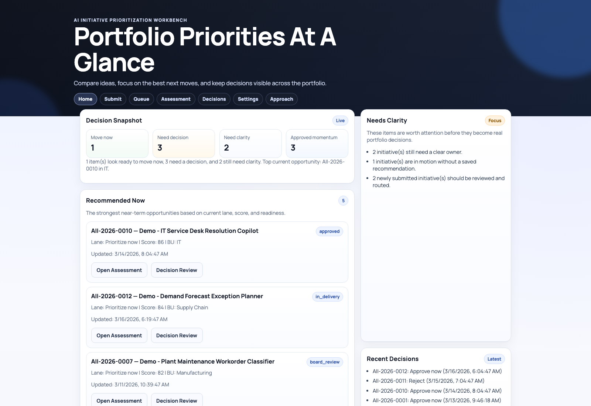
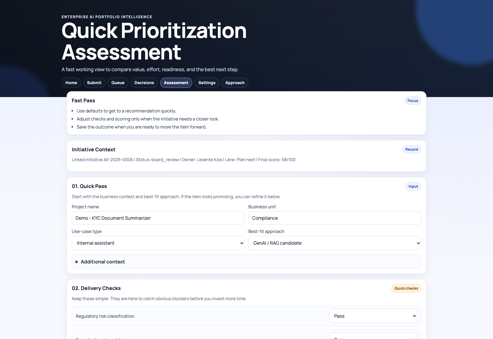

# AI Architect Decision Workbench

Decision-support system for AI portfolio governance in enterprise environments.

This portfolio project demonstrates how to prioritize AI initiatives with a transparent, auditable, and policy-aware methodology instead of ad-hoc judgment.

Current version: `0.3.4`

## Current product module
The most current working surface in this repository is [enterprise-ai-prioritizer/README.md](./enterprise-ai-prioritizer/README.md).

That module now presents the solution as a lighter decision workbench:
1. submit and route initiatives
2. assess value, readiness, and feasibility
3. register decisions with rationale
4. keep an audit trail in SQLite

## Current UI snapshots
### Decision dashboard


### Assessment workspace


## Project objective
Enable architecture and governance teams to answer:
1. Should this initiative even use AI?
2. Is it governance-ready enough to proceed?
3. If viable, where should it be prioritized in the portfolio?

## What is implemented
1. **Stage 0 fit check**
- `GenAI/RAG candidate`
- `Agentic candidate`
- `Classical ML candidate`
- `Deterministic automation candidate`
- `Not suitable yet (process redesign needed)`

2. **Stage 0 route and region policy**
- built-in policy profiles for `GenAI/RAG`, `Agentic`, `Classical ML`, `Deterministic`, and `Not suitable`
- region-aware policy profiles for `EU`, `US`, `EU + US`, and `Global`
- policy can enforce minimum gate states, threshold deltas, and tier caps before final prioritization

3. **Stage 1 mandatory tri-state gates**
- each gate is `Pass`, `Conditional`, or `Fail`
- `Fail` blocks prioritization (`NO-GO`)
- `Conditional` applies policy penalty and tier cap

4. **Stage 2 weighted scoring**
- criteria scored from `1` to `5`
- user-editable criterion weights
- automatic normalization to `100%` when entered total differs

5. **Evidence-aware scoring**
- each criterion includes evidence level:
  - `assumed` (low confidence)
  - `partial` (medium confidence)
  - `validated` (high confidence)
- evidence multipliers adjust score contribution
- confidence index is derived from the same evidence multipliers used in scoring

6. **Config page for current tuning**
- editable default weights
- tier thresholds (`A` / `B`)
- conditional gate penalty
- max tier when any conditional gate exists
- evidence multipliers
- editable Stage 0 route policy profiles
- editable region policy profiles
- persisted locally via browser storage

7. **Transparent decision report**
- raw score, gate penalty, decision score, and blocked diagnostic score when applicable
- tier and lane
- gate outcomes, policy outcomes, and rationale
- criterion-level breakdown (score, evidence, multiplier, contribution)

8. **Initiative intake and workflow**
- structured idea submission form
- triage queue with filters (status, BU, lane, owner)
- assessment page linked by initiative ID (`?id=...`)
- board decision page with rationale capture
- workflow states:
  - `draft`
  - `submitted`
  - `triage`
  - `assessment`
  - `board_review`
  - `approved`
  - `approved_with_conditions`
  - `hold`
  - `rejected`
  - `in_delivery`
  - `closed`

9. **Auditability and snapshots**
- audit trail entries for key actions:
  - initiative creation
  - status changes
  - assessment saves
  - board decisions
- persisted assessment snapshot includes:
  - Stage 0 outcome
  - gates
  - score details
  - weights and evidence used
  - config snapshot at decision time

10. **SQLite-backed initiative persistence**
- initiatives are stored in `enterprise-ai-prioritizer/data/initiatives.db`
- backend API is served by `enterprise-ai-prioritizer/server.py`
- workflow updates and board decisions are persisted outside browser memory

11. **Unit-tested decision engine**
- deterministic tests for:
  - score clamping
  - weight normalization
  - gate tri-state behavior
  - tier mapping and caps
  - stage 0 blocking rules
  - route and region policy behavior
  - blocked diagnostic score semantics
  - evidence confidence derivation

12. **Software engineering hardening**
- intake payload validation and sanitization
- explicit workflow state machine with transition guardrails
- safer DOM rendering for user-entered data in queue/board pages
- bounded audit history retention
- immutable identity fields on initiative updates

13. **Modern enterprise UI pass**
- simplified home as portfolio command center
- dedicated assessment workspace page for daily scoring decisions
- cleaner, Linear-inspired component styling and simplified navigation labels

## Selection logic (detailed)

### Stage 0: Is AI the right approach?
If initiative is marked `not suitable`, output is immediate `NO-GO` with lane:
- `Reframe / process redesign`

Other Stage 0 routes are not cosmetic labels. They feed policy:
- route-specific threshold deltas
- route-specific maximum tier caps
- route-specific minimum gate expectations

### Stage 1: Mandatory gates
Gates:
1. Regulatory risk classification
2. Security threat model
3. Data governance readiness
4. KPI baseline and unit economics definition

Gate behavior:
- `Fail`: hard block (`NO-GO`)
- `Conditional`: project can continue but receives:
  - score penalty (`conditionalPenalty * count`)
  - tier cap (`maxTierIfConditional`, default `B`)

### Region policy
Region also affects prioritization before lane assignment:
- `EU`, `US`, `EU + US`, and `Global` have different baseline expectations
- policy may require specific gates to be at least `Conditional` or `Pass`
- policy may tighten thresholds or cap the maximum tier
- if route/region policy baseline is not met, the result is `NO-GO`

### Stage 2: Weighted scoring model
Default criteria and baseline weights:
1. Business impact (20)
2. Strategic alignment and business ownership (15)
3. Time-to-value and urgency (10)
4. Platform leverage and reuse (10)
5. Technical and data feasibility (15)
6. ROI and unit economics (15)
7. Operating model readiness (10)
8. Residual risk after controls (5)

Formulas:
1. `effective_weight_i = entered_weight_i / sum(entered_weights) * 100`
2. `criterion_contribution_i = (score_i / 5) * effective_weight_i * evidence_multiplier_i`
3. `raw_score = sum(criterion_contribution_i)`
4. `diagnostic_score = max(0, raw_score - conditional_penalty_total)`
5. `confidence_index = weighted evidence multiplier ratio across all criteria`

### Lane mapping
1. `NO-GO` if Stage 0 is not suitable
2. `NO-GO` if any gate is `Fail`
3. `NO-GO` if route or region policy minimum baseline is not met
4. Otherwise, based on the policy-adjusted score thresholds:
- `Tier A`: `>= effective tierA threshold`
- `Tier B`: `>= effective tierB threshold` and `< tierA`
- `Tier C`: `< tierB`
5. If any gate is `Conditional`, tier is capped by policy (default cap: `B`)
6. If the initiative is blocked, the tool shows `diagnostic_score` for context but not as an approval signal

## UI pages
1. `index.html` (home dashboard)
- portfolio snapshot, priority queue, alerts, and recent decisions

2. `submit.html` (idea intake)
- structured form for idea collection

3. `triage.html` (triage queue)
- filters + quick routing to assessment and board

4. `assessment.html` (assessment workspace)
- context + Stage 0 + gates + scoring + executive output + assessment save

5. `board.html` (board view)
- lane/score review + decision + rationale

6. `config.html` (configuration console)
- defaults for weights, thresholds, conditional-gate behavior, evidence multipliers, and route/region policy profiles

7. `how-it-works.html` (method page)
- workflow explanation and governance decision flow

## Engineering Controls
1. **Data validation**
- required fields are enforced for initiative creation
- email format is checked
- per-field maximum length is enforced for stored text

2. **State integrity**
- status changes are validated against allowed transitions
- board decisions fail fast if transition is invalid

3. **Rendering safety**
- user data in queue/board pages is rendered via `textContent` instead of raw HTML interpolation

4. **Auditability**
- all major state changes write an audit event with actor, action, note, and timestamp
- audit trail is capped to avoid unbounded growth in SQLite

## Repository structure
```text
.
├── enterprise-ai-prioritizer/
│   ├── app.js
│   ├── assessment.html
│   ├── board.html
│   ├── board.js
│   ├── config.html
│   ├── config.js
│   ├── dashboard.js
│   ├── decision-engine.js
│   ├── index.html
│   ├── initiative-store.js
│   ├── server.py
│   ├── settings.js
│   ├── submit.html
│   ├── submit.js
│   ├── styles.css
│   ├── triage.html
│   ├── triage.js
│   ├── README.md
│   └── tests/
│       ├── decision-engine.test.js
│       └── initiative-store.test.js
├── CHANGELOG.md
├── VERSION
├── package.json
├── run_enterprise_ai_prioritizer.sh
└── view_files.sh
```

## Run locally
### Prerequisites
- Node.js `>= 20`
- npm `>= 9`
- Python `>= 3.10`

### Start app
```bash
cd enterprise-ai-prioritizer
python3 server.py --host 127.0.0.1 --port 8787
```

Open:
- `http://127.0.0.1:8787/index.html` (home dashboard)
- `http://127.0.0.1:8787/submit.html` (intake)
- `http://127.0.0.1:8787/triage.html` (triage)
- `http://127.0.0.1:8787/assessment.html` (assessment)
- `http://127.0.0.1:8787/board.html` (board)
- `http://127.0.0.1:8787/config.html` (config)
- `http://127.0.0.1:8787/how-it-works.html` (method)

Alternative:
```bash
./run_enterprise_ai_prioritizer.sh
```

## Run tests
From repository root:
```bash
npm test
```

Test coverage currently validates:
1. decision scoring engine behavior
2. gate and lane mapping logic
3. initiative API client and payload validation
4. payload validation and sanitization
5. workflow transition restrictions

## Best-practice baseline (Mar 2026)
Model design is aligned to:
1. EU AI Act timeline and obligations  
   [EU AI Act policy](https://digital-strategy.ec.europa.eu/en/policies/regulatory-framework-ai)
2. NIST AI RMF and GenAI profile  
   [NIST AI RMF Playbook](https://www.nist.gov/itl/ai-risk-management-framework/nist-ai-rmf-playbook)  
   [NIST AI 600-1](https://www.nist.gov/publications/artificial-intelligence-risk-management-framework-generative-artificial-intelligence)
3. OWASP LLM/GenAI risk taxonomy  
   [OWASP Top 10 for LLM Applications](https://owasp.org/www-project-top-10-for-large-language-model-applications/)
4. ISO governance and risk standards  
   [ISO/IEC 42001](https://www.iso.org/standard/42001)
5. AI FinOps and cost normalization  
   [FinOps for AI](https://www.finops.org/framework/scope/finops-for-ai/)  
   [FOCUS specification](https://focus.finops.org/focus-specification/)

## Portfolio value
This project showcases:
1. enterprise-grade decision architecture,
2. explainable prioritization logic,
3. governance-aware product design,
4. configurable policy-driven behavior,
   with route and region policy configurable in the Admin UI,
5. testing discipline for decision engines.
