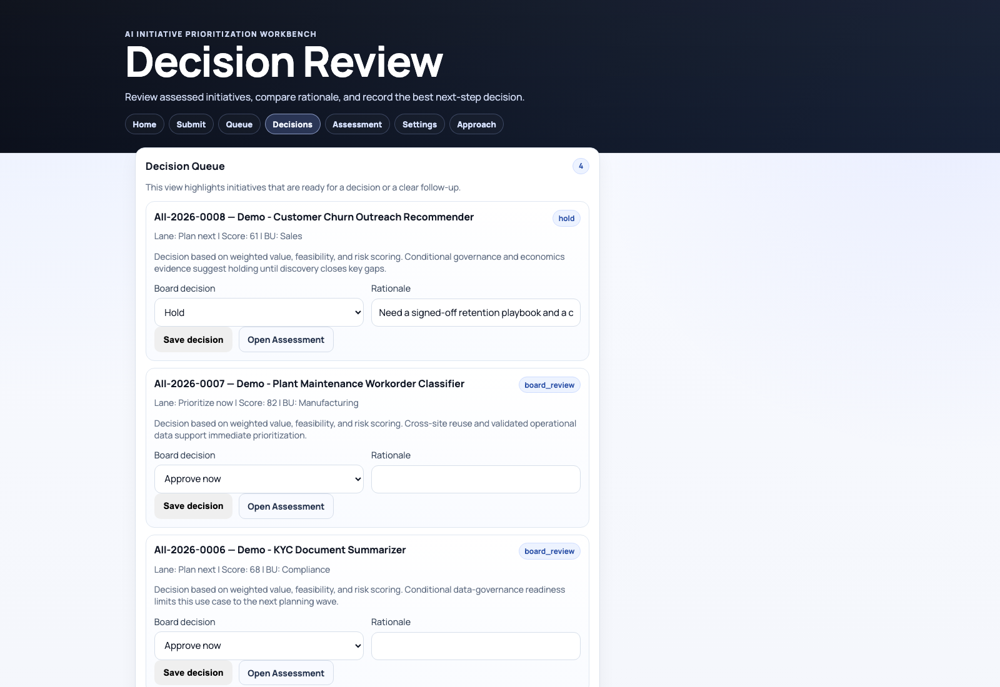
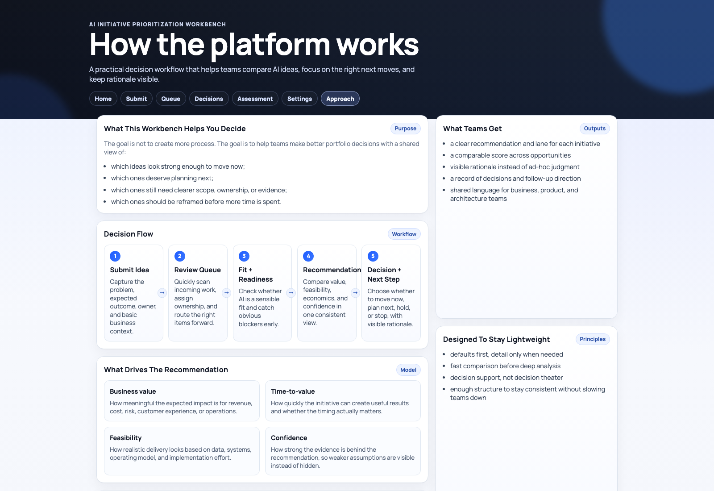

# Enterprise AI Prioritizer

Application module for the **AI Architect Decision Workbench**.

This module is the working product surface: teams submit initiatives, compare opportunities, save assessments, register decisions, and keep an audit trail in SQLite. The current UX is intentionally lighter than a governance portal. Governance is still present, but it sits behind a practical decision flow instead of dominating the experience.

For broader portfolio context, see [../README.md](../README.md).

## What the product does
The workbench helps teams answer four practical questions:
1. Is this actually a good AI opportunity?
2. Is it ready enough to move now?
3. What needs a decision versus more clarity?
4. What was decided, why, and based on what evidence?

The current flow is:
1. `Submit`: capture the initiative, sponsor, value hypothesis, and delivery context.
2. `Queue`: move work through triage and route the right items into assessment.
3. `Assessment`: use a quick pass, delivery checks, and weighted score drivers to produce a recommendation.
4. `Decision Review`: record approve, hold, reject, or proceed-with-follow-ups decisions.
5. `Dashboard`: surface what to move now, what needs a call, and what needs more clarity.

## Product surfaces
Core pages:
1. `index.html`: decision dashboard with recommended-now items, decision queue, clarity blockers, and recent decisions.
2. `submit.html`: lightweight intake form for new initiatives.
3. `triage.html`: operational queue for filtering and routing work.
4. `assessment.html`: assessment workspace with `Fast Pass`, `Delivery Checks`, advanced `Score Drivers`, and an executive recommendation.
5. `board.html`: decision review queue and rationale capture.
6. `config.html`: advanced settings for weights, thresholds, evidence multipliers, and policy defaults.
7. `how-it-works.html`: narrative explanation of the flow and scoring logic.

Backend and supporting logic:
1. `server.py`: HTTP API, static serving, and SQLite persistence in `data/initiatives.db`.
2. `decision-engine.js`: deterministic recommendation logic for fit, gates, score, confidence, and lane mapping.
3. `initiative-store.js`: frontend API client and payload normalization helpers.
4. `dashboard.js`, `triage.js`, `app.js`, `board.js`, `config.js`: page controllers.

## Overview


## Screenshots

### Decision dashboard


### Assessment workspace


### Decision review


### How it works


## Decision model
The recommendation engine still has structure and discipline, but the product now exposes it in a more lightweight way:
1. `Fit check`: screens whether the initiative is a sensible AI candidate and what approach fits best.
2. `Delivery checks`: captures the readiness signals that can block or constrain the recommendation.
3. `Weighted score drivers`: scores business impact, economics, feasibility, and related factors.
4. `Evidence-aware confidence`: reduces confidence when the case is based on assumptions rather than validated evidence.
5. `Lane mapping`: turns the result into a practical recommendation such as move now, plan next, explore further, or stop.

If an initiative is blocked by a hard fail, the app still shows diagnostic context, but it does not present that as an approval signal.

## Workflow and persistence
Workflow states are enforced in the backend:
`draft -> submitted -> triage -> assessment -> board_review -> approved/approved_with_conditions -> in_delivery -> closed`

Alternative branches:
1. `hold`
2. `rejected`

Operational safeguards already implemented:
1. payload validation and text normalization on intake
2. explicit status transition guards
3. audit events for creation, status changes, assessment saves, and board decisions
4. immutable identity fields for persisted initiatives
5. safer rendering of user content through DOM APIs instead of raw HTML interpolation

## Local run
```bash
cd enterprise-ai-prioritizer
python3 server.py --host 127.0.0.1 --port 8787
```

Open:
1. `http://127.0.0.1:8787/index.html`
2. `http://127.0.0.1:8787/submit.html`
3. `http://127.0.0.1:8787/triage.html`
4. `http://127.0.0.1:8787/assessment.html`
5. `http://127.0.0.1:8787/board.html`
6. `http://127.0.0.1:8787/config.html`
7. `http://127.0.0.1:8787/how-it-works.html`

## Tests
From repository root:
```bash
npm test
npm run test:e2e
```

The E2E flow currently covers:
1. initiative submission
2. triage status movement
3. assessment save
4. board decision
5. API and SQLite persistence checks

## Regenerating README screenshots
From repository root:
```bash
node enterprise-ai-prioritizer/scripts/capture-readme-screenshots.mjs
```

The script boots the local Python server on port `8791`, captures the current UI, and writes PNGs to `enterprise-ai-prioritizer/docs/screenshots/`.

## Current limitations
1. SQLite is still intended for local and single-instance usage, not multi-node production.
2. SSO and RBAC are not implemented yet.
3. Attachments are still represented as references/notes, not managed binary uploads.
